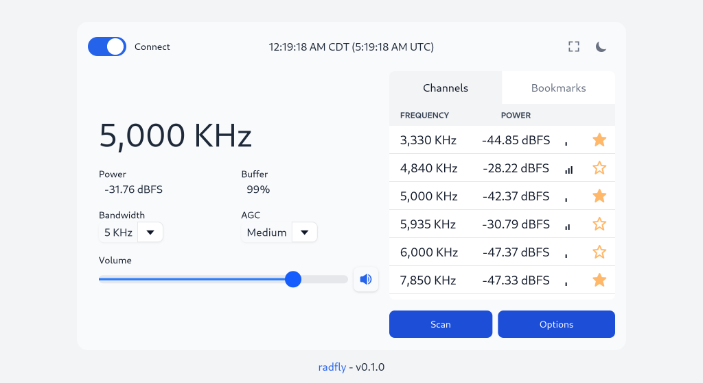
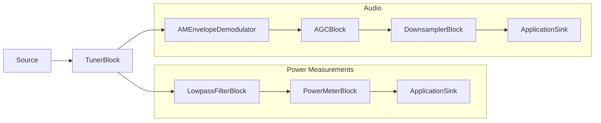

# radfly

radfly is a self-hosted, SDR-based listening server for AM medium wave and
short-wave radio stations with a simple web frontend. radfly is built on [ZigRadio](http://zigradio.org/)
and [http.zig](https://github.com/karlseguin/http.zig), and currently supports rtl-sdr and AirSpy HF+ SDRs.

The web frontend streams audio, supports scanning, bookmarks, and configuring
options like audio bandwidth and AGC mode. radfly can be run on Raspberry Pi 4
and similar single-board computers.



## Building

radfly requires Zig version 0.15.

```
$ git clone https://github.com/vsergeev/radfly.git
$ cd radfly
$ zig build -Doptimize=ReleaseFast
```

Install optional (but recommended) acceleration libraries:

* `sudo apt install -y libvolk-dev libliquid-dev libfftw3-dev` on Debian-based systems
* `sudo pacman -S libvolk liquid-dsp fftw` on Arch Linux-based systems

## Running

Start radfly with an SDR source, e.g. `mock` (for testing), `rtlsdr`, or `airspyhf`:

```
$ ./zig-out/bin/radfly --source airspyhf
```

radfly will be accessible at `http://localhost:8000`.

#### Local Network

Due to the dependency on [AudioWorklet](https://developer.mozilla.org/en-US/docs/Web/API/AudioWorklet) for streaming audio in the browser, the
radfly frontend must be served over a secure context (HTTPS) to be accessed
by other machines on a local network. [Caddy](https://caddyserver.com/) can be used as a secure reverse
proxy for this.

Start `caddy` (replace `radio-pi4` with your machine's hostname):

```
$ sudo caddy reverse-proxy --from radio-pi4.local --to :8000
```

radfly will now be accessible on the local network at `https://radio-pi4.local`.

#### Certificate Warning

`caddy` uses self-signed certificates for `*.local` hostnames, which can't be
trusted automatically by browsers and results in an insecure connection
warning. To remove this warning, import caddy's generated root certificate,
located at `/root/.local/share/caddy/pki/authorities/local/root.crt`, into your
browser's certificate manager.

## Usage

```
Usage: radfly [options]

Radio Configuration
  --source <mock,rtlsdr,airspyhf>     SDR Source (default mock)
  --device-index <index>              Device index (default 0)
  --bias-tee <true/false>             Bias tee (default false)
  --tune-offset <value in KHz>        Tune offset (default 50 KHz)
  --initial-frequency <value in KHz>  Initial frequency (default 5000 KHz)

Server Configuration
  --http-port <port number>           HTTP listening port (default 8000)
  --http-address <address>            HTTP listening address (default 127.0.0.1)

Miscellaneous
  --help                              Display usage
  --version                           Display version
  --debug                             Enable debug mode
```

## Design

The [ZigRadio](http://zigradio.org/) flowgraph consists of audio demodulation and power measurement
signal chains that feed into their respective `ApplicationSink`. Audio and
power samples are consumed by an application thread and pushed to active
clients via WebSockets. An RPC protocol over WebSockets allows clients to scan,
tune, and change various parameters in the flowgraph.



## Tests

Run unit tests with:

```
$ zig build test
```

## License

radfly is MIT licensed. See the included [LICENSE](LICENSE) file.
